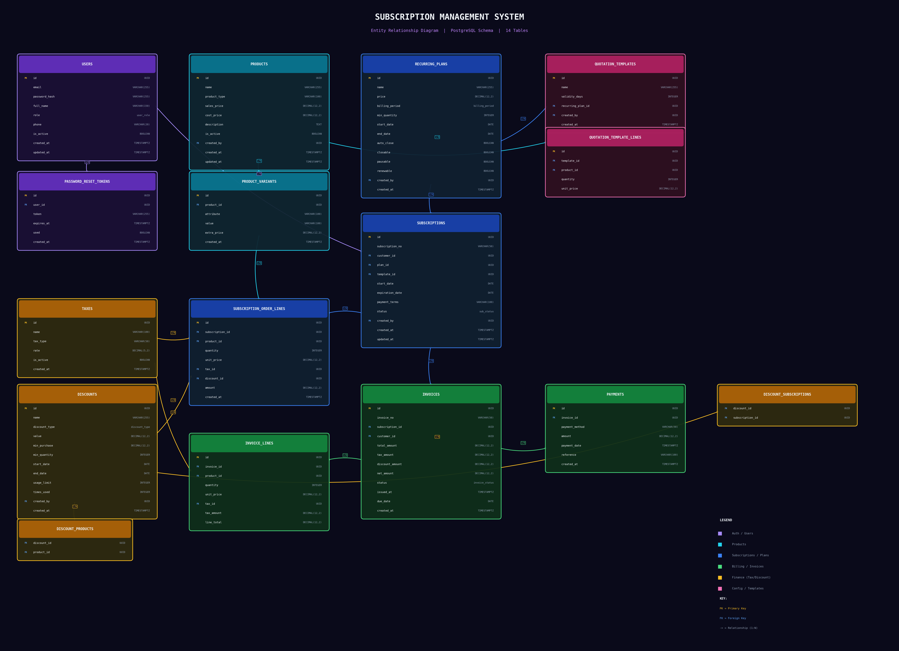

# SubManager - Subscription Management & Billing System

**Pulse Team No. 71** | Odoo Hackathon 2026

A full-stack SaaS subscription management and billing platform built for managing recurring subscriptions, invoicing, payments, and customer relationships.

---

## Features

### Subscription Lifecycle
- Multi-stage workflow: Draft &rarr; Quotation &rarr; Confirmed &rarr; Active &rarr; Paused/Closed
- Pause, resume, renew, upsell, and cancel operations
- Parent-child subscription tracking for renewals
- Full status history with audit trail

### Invoicing & Payments
- Auto-generate invoices from subscription order lines
- Tax and discount calculations at line level
- PDF invoice generation and email delivery
- Stripe checkout integration for online payments
- Manual payment recording (cash, bank transfer)
- Payment verification with post-redirect confirmation

### Billing Automation (Cron Jobs)
- **Auto-close**: Automatically close expired subscriptions
- **Recurring billing**: Generate invoices when billing period is due
- **Smart auto-renew**: Only renews system-expired subscriptions, not user-cancelled ones

### Role-Based Access Control
| Role | Access |
|------|--------|
| **Admin** | Full system access, user management, all configurations |
| **Internal User** | Manage subscriptions, invoices, discounts, reports |
| **Portal User** | Browse shop, subscribe, accept quotations, pay invoices, manage own subscriptions |

### Customer Portal (Shop)
- Product catalog with search, filter, and sort
- Plan-based pricing (not per-product pricing)
- Subscription request with variant and quantity selection
- Accept/reject quotations, pay via Stripe
- View invoices and payment history

### Email Notifications
- Welcome email on signup
- Internal user invite with credentials
- Quotation sent/accepted/rejected notifications
- Payment confirmation and subscription activation
- Subscription paused/closed/renewed alerts
- Invoice delivery with PDF attachment

### Reports & Analytics
- Revenue chart (12-month trend)
- Subscription status breakdown (pie chart)
- Monthly subscription trend (bar chart)
- Payment method distribution
- Overdue invoice tracking
- CSV export for all reports

### Discount & Tax Engine
- Fixed and percentage discounts
- Date-based activation with usage limits
- Minimum purchase/quantity requirements
- Product and subscription scoping
- Multiple tax rates (GST, VAT, Service Tax)

---

## Tech Stack

### Backend
| Technology | Purpose |
|-----------|---------|
| Node.js + Express 5 | REST API server |
| PostgreSQL | Relational database |
| Prisma ORM | Database access and migrations |
| JWT | Authentication (access + refresh tokens) |
| Stripe SDK | Payment processing |
| Nodemailer | Email delivery (Gmail SMTP) |
| node-cron | Scheduled billing jobs |
| Joi | Request validation |
| Helmet + CORS | Security |

### Frontend
| Technology | Purpose |
|-----------|---------|
| React 19 | UI framework |
| Vite 8 | Build tool |
| Tailwind CSS 4 | Styling |
| shadcn/ui | Component library |
| Recharts | Data visualization |
| Axios | HTTP client with token refresh |
| React Router 7 | Client-side routing |
| Sonner | Toast notifications |

---

## Getting Started

### Prerequisites
- Node.js 18+
- PostgreSQL 16+ (or Docker)
- Stripe account (for payment processing)

### Setup

1. **Clone the repository**
```bash
git clone https://github.com/easycodewithme/Billing-odoo.git
cd Billing-odoo
```

2. **Start PostgreSQL** (via Docker)
```bash
docker-compose up -d
```

3. **Backend setup**
```bash
cd server
cp .env.example .env
# Edit .env with your database URL, JWT secrets, Stripe keys, SMTP credentials
npm install
npx prisma migrate dev
npx prisma db seed
```

4. **Frontend setup**
```bash
cd client
npm install
```

5. **Run the application**
```bash
# Terminal 1 - Backend
cd server && npm run dev

# Terminal 2 - Frontend
cd client && npm run dev
```

6. **Open** http://localhost:5173

### Default Login Credentials

| Role | Email | Password |
|------|-------|----------|
| Admin | admin@example.com | Admin@123 |
| Internal User | sarah@example.com | Internal@123 |
| Internal User | mike@example.com | Internal@123 |
| Portal User | john.doe@example.com | Portal@123 |

---

## Project Structure

```
Billing-odoo/
├── client/                     # React frontend
│   └── src/
│       ├── api/                # API service layer
│       ├── components/         # Reusable UI components
│       ├── pages/              # Page components
│       ├── router/             # Route configuration
│       ├── contexts/           # Auth context
│       └── hooks/              # Custom hooks
│
├── server/                     # Express backend
│   ├── prisma/
│   │   ├── schema.prisma       # Database schema
│   │   └── seed.js             # Sample data
│   └── src/
│       ├── controllers/        # Route handlers
│       ├── routes/             # API routes
│       ├── services/           # Business logic
│       ├── middleware/         # Auth, validation, error handling
│       ├── validators/         # Joi schemas
│       └── config/             # Environment, Stripe, mailer
│
└── docker-compose.yml          # PostgreSQL container
```

---

## API Endpoints

| Module | Endpoints | Auth |
|--------|-----------|------|
| Auth | `/api/auth/*` | Public / Authenticated |
| Products | `/api/products/*` | Authenticated |
| Plans | `/api/plans/*` | Authenticated |
| Subscriptions | `/api/subscriptions/*` | Role-based |
| Invoices | `/api/invoices/*` | Role-based |
| Payments | `/api/payments/*` | Role-based |
| Discounts | `/api/discounts/*` | Admin / Internal |
| Taxes | `/api/taxes/*` | Admin / Internal |
| Users | `/api/users/*` | Admin / Internal |
| Reports | `/api/reports/*` | Admin / Internal |
| Shop | `/api/shop/*` | Public / Portal |
| Webhooks | `/api/webhooks/stripe` | Stripe signature |

---

## Database Schema

14 core tables: Users, Products, ProductVariants, RecurringPlans, Subscriptions, OrderLines, Invoices, InvoiceLines, Payments, Taxes, Discounts, QuotationTemplates, SubscriptionStatusLogs, AuditLogs



---

## Team

**Pulse - Team No. 71**

Built for the Odoo Hackathon 2026.

---

## License

This project is built for the Odoo Hackathon and is intended for demonstration purposes.
